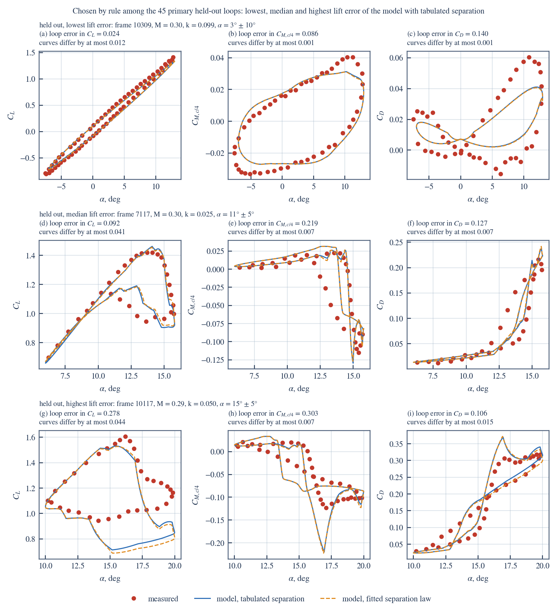
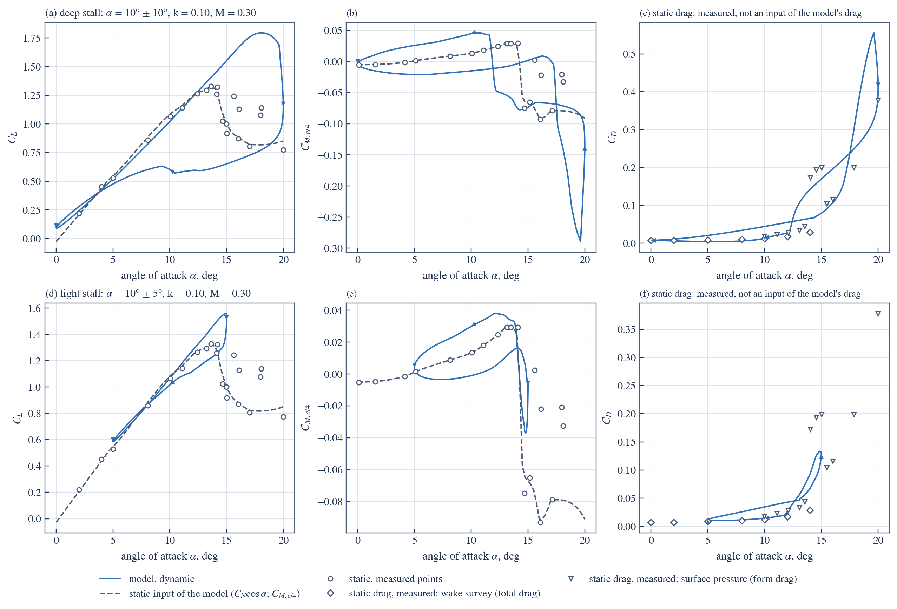
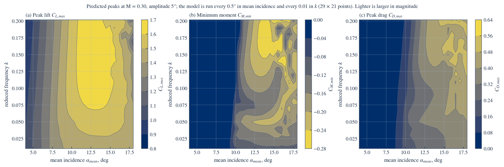
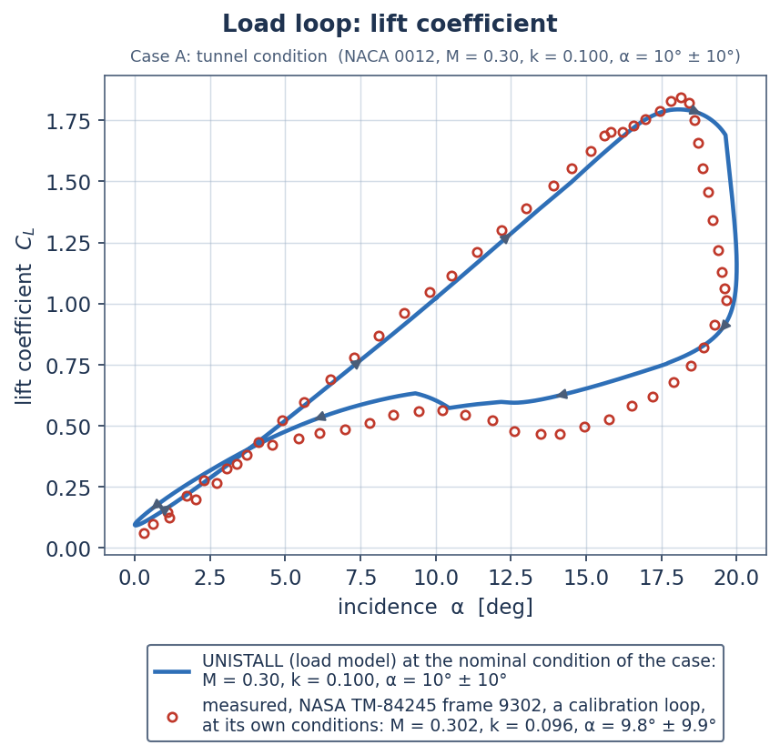
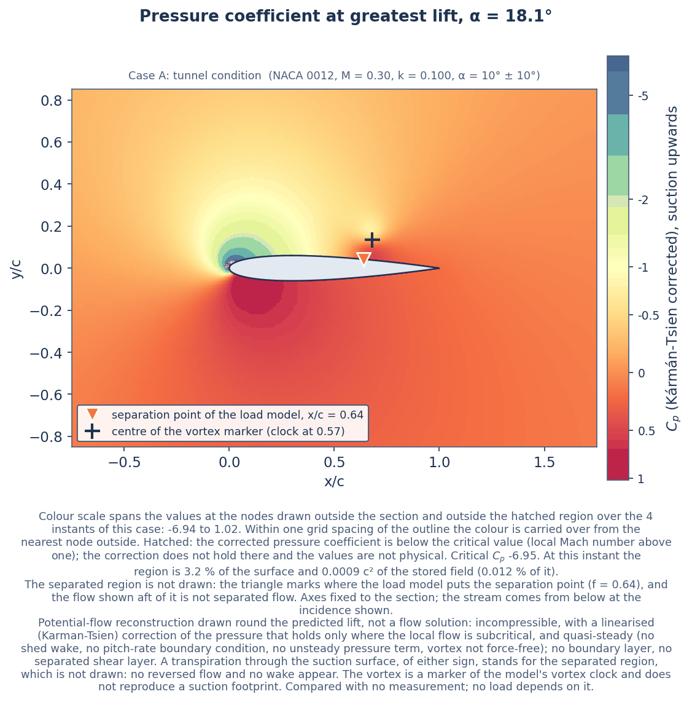

# UNISTALL: a dynamic-stall load model for a pitching aerofoil
### A Leishman–Beddoes model with tabulated separation, assessed against NASA TM-84245

**Author:** Akosa Samuel Onyejekwe (Independent Researcher)

---

## What this repository contains

UNISTALL (Python package `unistall`) computes the unsteady lift, drag and pitching
moment on an aerofoil pitching through stall, by the Leishman–Beddoes method
in indicial and in state-space form, with the trailing-edge separation point
and the static moment read from measured static data instead of a fitted
curve.

| Where | What |
|---|---|
| [`unistall/dsmodel.py`](unistall/dsmodel.py) | **The solver.** It marches the loads in time; `attached_flow.py` and `static_model.py` supply the attached-flow loads and the static inputs |
| [`results/figures/`](results/figures) | **Every figure**: loops, contour maps, error plots, calibration, model states |
| [`results/`](results) | **Every table of results** (`.csv`, `.json`), each written by one script |
| [`data/`](data) | Inputs: verified conditions of the measured loops, digitised static data, calibration and held-out sets, targets |
| [`docs/formulation.md`](docs/formulation.md) | Every equation and constant |
| [`tests/`](tests) | Test suite |

The measurements are those of McCroskey, McAlister, Carr & Pucci (1982), *An
Experimental Study of Dynamic Stall on Advanced Airfoil Sections*, NASA
TM-84245: NACA 0012 and Ames A-01 sections, chord 0.61 m, Mach numbers up to
0.30. Of their NACA 0012 oscillating-aerofoil loops, 65 lie inside the Mach
range of the static data (20 used for calibration, 45 held out) and
carry the claims made here; 19 more, below that range, are scored
and reported but support no claim. 38 Ames A-01 loops are scored
as a second section.

It is a load model, not a flow solver: it returns forces and moments on the
section. The model itself has no mesh and computes no flow field. The case
study adds a reconstructed field, drawn round the predicted lift for
illustration (see Case study); no load depends on it.

---

## Results at a glance

Every figure and table below is written by a script that runs the solver or
reads a file the solver wrote; a test fails if one is present that no script
draws. What is not computed by the solver is measured: the points of the
oscillating loops it is compared with, and the static data it reads as inputs
(the digitised static lift, moment and drag, and the slope, zero-lift
incidence and stall level taken from the quasi-steady sweeps).



*Fig. 5. Measured and predicted lift, moment and drag loops for three held-out
frames chosen by rule from the model's own lift error: the lowest, the median
and the highest. Each panel gives the loop error and the largest difference
between the tabulated and the fitted separation law; the Mach number of each
loop is in its title.*



*Fig. 7. Predicted lift, moment and drag loops, deep stall and light stall,
against the static curves the model reads (lines) and the measured static
points (symbols). Static drag is measured and is not an input of the model's
drag. Three surface-pressure drag points between 14.0 and 15.0 degrees lie
above their neighbours; they are plotted as measured.*



*Fig. 8. Predicted peak lift, minimum moment and peak drag over mean incidence
and reduced frequency, as filled maps with a scale bar. The roughness above
about 15 degrees mean incidence is the model's switching and repeated
shedding, not noise in the plot.*

| Figure | Shows |
|---|---|
| [Fig. 1](results/figures/fig01_static_inputs.png) | Static normal force, separation point and moment at the two Mach stations |
| [Fig. 2](results/figures/fig02_attached_flow.png) | Attached-flow loads against Theodorsen's solution |
| [Fig. 3](results/figures/fig03_attached_moment.png) | Moment loops that peak below static stall: unsteady terms at full strength and with the empirical factor (literature stall constants; frame 7110 reaches the model's onset level, which is the kink near its peak) |
| [Fig. 4](results/figures/fig04_calibration_loops.png) | Three calibration loops with their RMS errors. The secondary bumps and slope breaks in the predicted loops come from repeated shedding and the switching of time constants; the measured loops have no counterpart to them |
| [Fig. 5](results/figures/fig05_held_out_loops.png) | Three held-out loops chosen by rule, both separation laws |
| [Fig. 6](results/figures/fig06_effect_of_constants.png) | Effect of the constants on one held-out deep-stall loop |
| [Fig. 7](results/figures/fig07_dynamic_and_static.png) | Dynamic loops against the static curves |
| [Fig. 8](results/figures/fig08_design_space.png) | Contours of the predicted peaks over mean incidence and reduced frequency |
| [Fig. 9](results/figures/fig09_damping_map.png) | Cycle damping over the same plane, with the measured loops |
| [Fig. 10](results/figures/fig10_mach_trends.png) | Contours of the predicted peaks over reduced frequency and Mach number |
| [Fig. 11](results/figures/fig11_error_by_condition.png) | Loop error against stall depth and frequency |
| [Fig. 12](results/figures/fig12_separation_laws.png) | Tabulated against fitted separation law, paired differences |
| [Fig. 13](results/figures/fig13_cycle_damping.png) | Predicted against measured cycle damping |
| [Fig. 14](results/figures/fig14_calibration.png) | Cost of every start, sensitivity, cross-validation, cost surface |
| [Fig. 15](results/figures/fig15_model_states.png) | The solver's internal states over one cycle, with the number of times the vortex clock starts in the cycle and how many of those are repeated sheddings |
| [Fig. 16](results/figures/fig16_accuracy_summary.png) | Held-out errors, 95 % intervals, measurement floor and targets |
| [Fig. 17](results/figures/fig17_convergence.png) | Loads and loop errors against step size and cycles marched |
| [Fig. 18](results/figures/fig18_state_space.png) | The state-space form against the indicial march |

The tables are in [`results/tables.md`](results/tables.md): the measured loops
used, static inputs, constants, the attached-flow moment, accuracy against the
targets, accuracy by stall depth, the two separation laws, cycle damping, the
attached-flow check, the second aerofoil, every target against its measured
value, numerical convergence and the post-stall curve.

---

## Findings

**1. Tabulated and fitted separation laws are equally accurate on this data set; the loads they predict are close, not identical.** With the same dynamic constants in both models, over three sets of constants (literature values, and those fitted for each model), a separation point tabulated from the static measurements and the standard three-parameter exponential fit of the same measurements score alike against 45 held-out loops: mean loop errors differ by at most 0.0017 and stall timing by at most 0.02°, and the 95 % interval of every loop-error difference lies inside the equivalence margin recorded beforehand in `data/targets.json` (one tenth of each accuracy target). Of the 18 paired comparisons 5 favour the fitted law and 2 the tabulated one at the 95 % level, and the fitted law has the lower mean loop error in 8 of 9 rows, so there is a small bias in its favour. The predicted loads themselves are compared directly, as the RMS difference between the two predictions over the cycle divided by the measured range, averaged over the loops: lift 0.0101 to 0.0116 (upper 95 % limit 0.0140, margin 0.010; worst loop 0.047; largest difference at any instant 0.243 in the coefficient, frame 10120); moment 0.0052 to 0.0074 (upper 95 % limit 0.0114, margin 0.015; worst loop 0.081; largest difference at any instant 0.105 in the coefficient, frame 10120); drag 0.0086 to 0.0096 (upper 95 % limit 0.0116, margin 0.020; worst loop 0.038; largest difference at any instant 0.083 in the coefficient, frame 10120). At that margin the loads are equivalent in moment and drag and are not shown to be equivalent in lift. For scale, the model's own error against measurement is 0.11 to 0.20 (`results/comparison_same_constants.csv`, `results/equivalence.csv`, `results/load_difference_per_frame.csv`).

**2. What separate calibration shows.** Calibrated separately by the same script, the two models differ at the 95 % level in: drag loop error 0.153 against 0.151 (fitted law better; with identical constants the difference is at most 0.001); peak-lift error (per cent) 4.531 against 4.348 (fitted law better; with identical constants the difference is at most 0.134); incidence of moment stall (degrees) 0.622 against 0.648 (tabulated law better; with identical constants the difference is at most 0.005). For peak-lift error (per cent) at least half of the difference remains with identical constants, so it belongs to the separation law; the rest come from the values each calibration gave the constants.
(`results/comparison.csv`)

**3. Accuracy on held-out loops.** 45 held-out NACA 0012 loops, each
run at its own measured conditions (`results/validation_targets.csv`). Loop
errors are RMS differences divided by the measured range of the quantity over
the loop. The targets are in `data/targets.json` and were set before the
held-out loops were scored with this form of the model
([`docs/provenance.md`](docs/provenance.md) gives the dated record). Each
limit is the stricter of an absolute limit and three quarters of what the
earlier form of the model had scored on the same loops:
lift 0.1 and 0.1106 (baseline 0.1475); moment 0.15 and 0.1936 (baseline 0.2581); drag 0.2 and 0.3032 (baseline 0.4043); incidence of maximum lift 1 and 0.7238 (baseline 0.965); incidence of moment stall 1 and 1.1063 (baseline 1.475). The absolute limits are the author's working limits, not
a standard, and the held-out loops had been looked at with the earlier form,
so they are a consulted test set and not an untouched one. They are never
used in a fit.
`results/targets_scoreboard.csv` lists every target with its measured value:
Targets met: 12 of 17 on the model against measurement or theory, 8 of 8 on the numerical method, 9 of 9 on the software. Not met (5): `no_stall_frame_nRMS_CM_max` (0.1235 against at most 0.1); `mean_nRMS_CL_max` (0.1067 against at most 0.1); `mean_nRMS_CM_max` (0.1959 against at most 0.15); `damping_sign_agreement_min` (0.6 against at least 0.8); `margin_CL` (0.01402 against at most 0.01).

| Measure | Measured | Target | Met |
|---|---|---|---|
| Loop error, lift | 0.107 | at most 0.100 | no |
| Loop error, moment | 0.196 | at most 0.150 | no |
| Loop error, drag | 0.153 | at most 0.200 | yes |
| Incidence of maximum lift | 0.57° | at most 0.72° | yes |
| Incidence of moment stall | 0.62° | at most 1.00° | yes |
| Sign of cycle damping correct | 60% | at least 80% | no |

The error a perfect model would show from the stated measurement uncertainty
alone is 0.028 in lift,
0.059 in moment and
0.059 in drag (`results/uncertainty_summary.csv`);
the errors above are 3.8,
3.3 and
2.6 times that. The
figure for drag rests on an assumed uncertainty of the pressure drag, for
which the report gives no number, and all three treat the quoted uncertainty
as a random error of each point; if it is a bias instead, it does not average
out and the same figures are its size.

The incidence error of moment stall is defined only where both the
measurement and the model show a moment stall on the up-stroke:
29 of the 45 loops. The model misses a
measured moment stall on 3 loops and
predicts one that is not measured on 0
(`results/validation_moment_stall.csv`).

All 20 calibration loops are at Mach 0.285 or above.
41 of the held-out loops are too (lift
0.107, moment 0.198,
incidence of maximum lift 0.45°); the
4 below it, at Mach
0.22 to 0.28, give
lift 0.102, moment 0.175
and 1.82°. Leaving out the
6 held-out loops whose conditions
repeat a calibration loop changes the lift and moment errors to
0.106 and 0.198.

**4. Where the error sits.** The same held-out loops grouped by how far the
peak incidence goes beyond static stall (`results/validation_by_stall_depth.csv`):

| Group | Loops | Lift | Moment | Drag | Damping sign correct |
|---|---|---|---|---|---|
| attached or marginal (peak less than 2 deg beyond static stall) | 19 | 0.093 | 0.241 | 0.209 | 47% |
| light stall (2 to 6 deg beyond) | 7 | 0.131 | 0.155 | 0.152 | 43% |
| deep stall (6 deg or more beyond) | 19 | 0.112 | 0.166 | 0.096 | 79% |

**5. Cycle damping is not predicted through stall**
(`results/validation_damping.csv`, `results/attached_moment_factor.json`).

- *Before stall onset.* With its unsteady moment terms at full strength the model gives more pitch damping than is measured in attached flow. An empirical factor of 0.728 on those terms is the value that minimises the moment error over the attached part of 19 calibration loops (184 measured points that the model places before stall onset); its 95 % bootstrap interval over loops is 0.61 to 0.89. On the 3 loops whose peak incidence is below static stall (frame 7110, k = 0.10: measured 0.160, model at full strength 0.212, of which 0.042 comes from reading the static moment table at the lagged incidence (with the table read at the incidence itself 0.170), with the factor 0.165; frame 10221, k = 0.10: measured 0.140, model at full strength 0.200, of which 0.030 comes from reading the static moment table at the lagged incidence (with the table read at the incidence itself 0.170), with the factor 0.153), 49% to 81% of the excess damping comes from the lagged reading of the static table; moving the attached part of that reading to the circulatory incidence changes it little, so the lag is largely physical and the factor corrects an excess of the inviscid unsteady moment over measurement. Taken alone, the 2 of those loops with a closed moment loop would choose 0.60 and 0.71. Over the interval of the factor the held-out moment error moves between 0.1955 and 0.1984 and the damping-sign agreement between 0.578 and 0.622 (`results/uncertainty_summary.csv`). The loops are below static stall but not all free of stall in the model: on frame 7110 the lagged normal force reaches 1.05 of the onset level and a vortex of normal force 0.016 is shed. The factor makes the moment error worse on frame 10218 (k = 0.01, 0.098 to 0.100). The factor is a correction of this model, from few loops at one Mach number, not a measurement of the flow.
- *Stalled loops.* On the 45 held-out loops with a closed
  measured moment loop the sign of the damping is predicted correctly on
  60%; a prediction of positive damping everywhere
  would score 67%. The correlation
  between predicted and measured damping is 0.33 and the
  RMS error 0.120. On the 19 loops that
  pass static stall by 6° or more the sign is correct on
  79%.
- *How certain the measured sign is.* The stated uncertainty of the measured
  moment gives the measured damping an uncertainty of
  0.015 if the error is random from point to
  point and up to 0.085 if it follows the
  stroke. The measured sign is certain in the first sense on
  35 loops (model sign correct on
  66%, always-positive
  74%) and in the second on
  21 (model 86%, always-positive
  86%).
- *Negative damping.* 15 held-out loops measure negative
  damping; the model predicts negative damping on
  0 of them, and on
  3 loops whose measured damping is positive.
  **The model does not predict cycle damping through stall with useful
  accuracy. It cannot locate a stall-flutter boundary and is not offered for
  that purpose.**

**6. The model is provided in indicial and state-space form.** The indicial
march of `unistall/dsmodel.py` and the same equations written as
14 first-order differential equations and integrated by the
classical fourth-order Runge–Kutta method (`unistall/statespace.py`) give the
same loads to the differences that follow: on the 24 loops of the calibration set
(20 inside the Mach range of the static data, which are the ones
used in the fit, and 4 below Mach 0.20, used here only to exercise the low-Mach blend) the largest
difference in any loop error is 0.0004
(target 0.002), in cycle damping
0.0003, and at any instant
0.5 % of the range in lift and
2.0 % in moment; those largest
instantaneous differences sit where the model switches a time constant, which
the two forms resolve to one step (`results/statespace_summary.csv`, Fig. 18).
Coupled to a torsional section, the pitch angle, its rate and the aerodynamic
states are integrated as one system and give the same growth or decay as the
step-by-step coupling in all 6 of 6 conditions
(`results/structural_checks.csv`). The state-space form covers the same Mach
range as the indicial one: 4 of those loops
are below Mach 0.20, down to Mach 0.04, where the
incompressible loads are blended in.

---

## Limits of the model

Targets not met on the held-out loops:

- **Loop error, lift:** 0.107 against a target of at most 0.100.
- **Loop error, moment:** 0.196 against a target of at most 0.150.
- **Sign of cycle damping correct:** 60% against a target of at least 80%.

The calibration lowers the cost by 11 % from the literature
constants. The 8 starts refined at full resolution reach costs from 1.906 to 2.013; 4 of them are within 1 % of the lowest, so the constants are one of several near-equal solutions (`results/calibration_runs.csv` lists them all).

Behaviour at the limits (`python3 -m unistall.check_limits`, Table 12b). *Mirror image:* normal force and moment are odd about the zero-lift incidence to 3e-14 in normal force; lift and drag are resolved on the experiment's incidence scale, so a loop and its mirror image differ in drag by up to 0.013 (`results/limit_mirror_pair.csv`). *Static limit:* the drag of a slow sweep is not the measured static drag, which is total drag from a wake survey where the loops are pressure drag: between 0 and 12° the model is higher by up to 0.018, and through stall the two differ by up to 0.11 (`results/limit_static_drag.csv`). *Zero lift:* on the 11 loops that cross it the lowest chord force is 0.0000 and the lowest drag -0.0006; drag is below zero for 0.049 of the cycle on frame 9307 (held-out) (`results/limit_zero_lift.csv`). *Switching rules:* the vortex clock restarts within a cycle on 57 of 65 loops, up to 31 sheddings in a cycle on the slowest; the rule that removes vortex lift opposing the separated force acts on 60 loops and removes at most 0.0026 in normal force (`results/limit_vortex_rules.csv`).

Beside the published model (`python3 -m unistall.published_reference`, Table 9b). For two NACA 0012 cases at Mach 0.3 and reduced frequency 0.1, Leishman and Crouse (1989) plot the Leishman–Beddoes model against the measurements. Scored against the same traced points with the same loop error: 9.9 +/- 9.9 deg, normal force: published model 0.038, this model 0.077; 9.9 +/- 9.9 deg, moment: published model 0.075, this model 0.113; 15 +/- 10 deg, normal force: published model 0.072, this model 0.081; 15 +/- 10 deg, moment: published model 0.110, this model 0.127. This model has the lower error in 0 of 4 comparisons; the two models differ from each other by 0.060 to 0.097 of the measured range. The published curves are for the constants their authors chose for these conditions; this model's constants are fitted to 20 loops at once. Neither case is a new test of this model (`results/published_reference.csv`).

The stall-onset level is taken from the static-stall normal force and is not
fitted. Multiplying it by 0.92 to 1.08 raises the calibration cost from 1.906 at a factor of 1.00 to between 1.997 and 2.082
(`results/onset_level_check.csv`). That check moves the level with the other
constants held, on the calibration cost only, so it does not show that the
misses above are independent of where onset is placed.

Other limits:

- **Range.** Static data are at Mach 0.215 and 0.302. Of the 45
  held-out loops, 41 are at Mach 0.290 to
  0.302, where every calibration loop also lies; the other
  4, at Mach 0.220 to 0.283, are probes of
  the interpolation in Mach number and are predicted worse (finding 3), so
  the comparison is in effect at Mach 0.29 to 0.30. Reduced frequency runs up
  to 0.202 and peak incidence up to 25° on the NACA 0012
  section, in sinusoidal pitch only. The experiment stops at Mach
  0.30. The model reports any condition outside that range and refuses it
  when called with `strict=True`. Nothing is claimed outside it.
- **Numerical resolution.** There is no spatial mesh; the discretisation is
  the time step, set to at most 0.02 semichords of travel. Against a march
  with four times as many steps the loop error of any calibration loop
  changes by at most 0.0008, and
  against four more cycles by
  0.0000
  (`results/convergence_summary.csv`, Fig. 17).
- **Static inputs.** Past static stall the measurements have two states; the
  model follows the more separated one, which gives a calibration cost of
  2.14 against 3.33
  (`results/static_curve_choice.csv`). The static data above 17° at the lower
  Mach station come from a sweep at Mach 0.204.
- **Low Mach number.** The compressible indicial constants alone differ from
  Theodorsen's solution at Mach 0.05 by 6.4 %
  in lift amplitude and 12.9 % in moment
  amplitude. The model blends them with the incompressible loads below Mach
  0.20 and then agrees to 1.9 % and
  0.0 %
  (`results/attached_checks.csv`). No dynamic-stall loop below Mach 0.20 is used
  for a claim.
- **Drag.** Over every scored loop inside the Mach range, calibration and
  held-out, drag is negative for at most 4.9 % of a
  cycle (limit 5 %, on
  frame 9307) and its
  lowest value is -0.0006 (limit -0.01);
  both limits are met on every loop
  (`results/validation_table.csv`, `results/separated_checks.csv`).
- **Other sections.** On a second aerofoil (Ames A-01,
  38 loops) with the dynamic constants unchanged,
  that aerofoil's own static data against the NACA 0012 static data give:
  lift loop error 0.216 against 0.223 (better); moment loop error 0.390 against 0.372 (worse); drag loop error 0.308 against 0.261 (worse); peak-lift error 9.5 % against 14.1 % (better). Transfer to another
  section without re-calibration is not shown.
- **Scope.** This is an aerofoil model in a steady stream with prescribed
  pitch. It is not a rotor calculation and no rotor data are compared with.
  The dynamic measurements are not corrected for wall interference.

---

## Case study

The numbered folders hold a case study built on the solver: the section at a
tunnel condition (Case A) and at a rotor-blade-station condition (Case B),
with its geometry, a grid, the solution files, reconstructed flow fields,
plots, a report and illustrative drawings. `python3 run_all.py` reproduces it.
[`00_overview/case_definition.md`](00_overview/case_definition.md) states what
each part is and is not.

| Case | Peak lift | at incidence | Minimum moment | Peak drag | Stall onset |
|---|---|---|---|---|---|
| A: tunnel condition | 1.795 | 18.1° | -0.290 | 0.555 | 14.4° |
| B: rotor-blade-station condition | 1.745 | 17.0° | -0.237 | 0.436 | 13.8° |

| Folder | Contents |
|---|---|
| [`00_overview/`](00_overview) | The case definition, and a list of what every numbered folder holds and which script writes it |
| [`01_geometry/`](01_geometry) | Section coordinates and thickness |
| [`02_mesh/`](02_mesh) | An O-grid round the section; the solver does not read it, the reconstructed field is evaluated at its nodes |
| [`03_model_setup/`](03_model_setup) | Flow conditions, kinematics, air properties, solver configuration, static inputs |
| [`04_solver/`](04_solver) | The driver for the two cases and a command-line entry for a single condition (the solver itself is the `unistall` package) |
| [`05_solution/`](05_solution) | Time histories, surface pressures, reconstructed fields, the model's slow-sweep polar, metrics, convergence |
| [`06_postprocessing/`](06_postprocessing) | Hysteresis loops, contour maps of the reconstructed field (pressure, Mach number, temperatures, speed, vorticity), surface plots, and `validation/`, the comparison with measurement set out from the result files |
| [`07_report/`](07_report) | The case-study report, a plots album and a data dossier |
| [`08_engineering_drawings/`](08_engineering_drawings) | Four illustrative sheets, every dimension from one sourced table |

**The flow fields are a reconstruction, not a flow solution**: a potential
flow drawn round the lift the model predicts, with an outflow through the
suction surface standing for the separated region and chosen so that the flow
leaves the trailing edge smoothly. The field is incompressible; its pressure
is corrected for compressibility by the Kármán–Tsien rule, and local Mach
number and temperatures follow from the corrected pressure by the isentropic
relations. That correction holds only where the flow is subcritical: where
the corrected pressure is below the critical value the points are flagged,
hatched in every figure and counted, and are not physical. There is no
boundary layer or separated shear layer. It is given the lift only: the pitching moment and pressure drag of its surface pressure do not agree with the model's (difference at peak lift, Case A: moment +0.277, drag -0.466, same sign of moment at 2 of 6 stored instants; Case B: moment +0.244, drag -0.415, same sign of moment at 3 of 6 stored instants), so no moment or drag should be read from it. None of it
is compared with a measurement and no load depends on it. **Case B is not a
rotor calculation**: it is the section in a steady stream at a blade station's
Mach number and reduced frequency. The evidence for the model's accuracy is in
the findings above, not in the case study.



The measured loop drawn with Case A is frame 9302, a calibration loop: the
constants were fitted with it, so this figure shows a fit and not a prediction.



---

## The model in brief

- **Attached flow.** Circulatory lift from two deficiency functions on the
  three-quarter-chord incidence; impulsive loads for incidence and pitch rate
  with the time constant c/a; unsteady moment terms for both.
- **Separation.** Pressure lag on the normal force, boundary-layer lag on the
  separation point, Kirchhoff's relation for the separated normal force.
- **Dynamic stall.** A leading-edge vortex is shed when the lagged normal
  force exceeds the static-stall level; its lift accumulates while it is over
  the chord and decays afterwards; repeated shedding is allowed.
- **Static inputs vary with Mach number.** Maximum static lift in this
  experiment is 1.64 at Mach 0.215 and 1.36 at Mach
  0.302, so slope, stall level and separation point are interpolated
  between two Mach stations.
- **Constants.** Fitted on 20 calibration loops: Tp = 1.652, Tf0 = 6.278, Tv0 = 6.318, Tvl = 8.392, eta = 0.907.
  Returned to literature values because the data do not identify them:
  none. Change of the calibration cost for a 10 % change of each constant in the fit of all five: Tp: 0.26 %, refined starts differ by 0.84; Tf0: 0.17 %, refined starts differ by 2.53; Tv0: 0.08 %, refined starts differ by 5.90; Tvl: 3.84 %, refined starts differ by 5.93; eta: 30.93 %, refined starts differ by 0.00. Cross-validation over 5 folds (sensitive only against none: mean improvement 0.0170 a fold, standard error 0.0091, kept; all against sensitive only: mean improvement 0.0160 a fold, standard error 0.0051, kept).

Every equation and constant is in [`docs/formulation.md`](docs/formulation.md).

---

## Data

- 148 of 149 measured loops have their Mach number, reduced
  frequency, mean angle, amplitude and aerofoil checked against the tables of
  NASA TM-84245 Volume 1 (`data/data_manifest.csv`).
- Static lift, moment and drag at Mach 0.30 are digitised from the report's
  own figures and tables, each point with its source page and uncertainty
  (`data/static_naca0012_M030_*.csv`).
- The split into calibration and held-out loops (`data/split.json`) is a rule on the frame number (divisible by three: calibration) for every loop but 5, which were in use before the rule was written and were fixed by name: 9302 (calibration), 9217 (held-out), 9214 (held-out), 7113 (held-out), 10118 (held-out). 2 of them depart from the rule: 9302 is in the calibration set where the rule gives held-out; 7113 is in the held-out set where the rule gives calibration. Held-out measures with the split as fixed: lift 0.1067, moment 0.1959, damping sign 0.6000; with those 2 frames moved to the set the rule gives (constants unchanged, so the frame moved out of calibration has been fitted): lift 0.1046, moment 0.1916, damping sign 0.6222; with them left out: lift 0.1055, moment 0.1933, damping sign 0.6136. No target changes from met to not met or back. (`results/split_fixed_frames.csv`, `results/split_departures.csv`)
- **The measured loops are third-party data and are not distributed here.**
  `python3 -m unistall.fetch_frames` downloads them from one fixed commit of
  the source repository and checks each file against the SHA-256 recorded in
  `data/frames_inventory.csv`; it names any file that is missing or has
  changed. If the source is ever withdrawn or altered, the results cannot be
  reproduced from it: the same loops are printed in Volume 2 of the NASA
  report and would have to be digitised again, and the recorded checksums
  show whether a copy obtained elsewhere is the one used here.
- `data/data_sources.csv` lists each source with the tables, figures and
  pages that the data files use, and `python3 -m unistall.build_manifest
  --check` rebuilds the list of usable loops from the report's tables.

---

## Reproducing the results

**A quick check.** `python3 -m pytest -q` runs in minutes. It recomputes the
held-out measures from the stored constants and the fetched loops and
requires them to equal the recorded ones, re-derives the data manifest and
the source log, checks the model against theory and against its own
invariances, and fails if a table, figure or document is not what its script
writes. That is the path for a reader who wants to confirm the results
without repeating the calibration.

**The whole chain** takes many hours, most of it the calibration of the two
models and its cross-validation; the commands below are in the order they
are run. The state-space form is slower than the indicial march by the
factor given in `results/statespace_summary.csv` and is used for the checks
only; every reported result comes from the indicial march.

```bash
pip install -r requirements-lock.txt     # run everything from the repository root
pip install -e .                         # or `pip install .` to use the model outside the clone

python3 -m unistall.fetch_frames              # measured loops (needs network)
python3 -m unistall.static_stations           # slope, zero-lift incidence and stall level from the two static sweeps
python3 -m unistall.static_polar              # static polar at Mach 0.30 from the digitised points
python3 -m unistall.static_model              # static inputs by Mach number
python3 -m unistall.check_attached            # attached-flow checks against Theodorsen
python3 -m unistall.check_indicial            # compressible branch against exact starting values and short-time lift
python3 -m unistall.calibrate --attached      # unsteady-moment factor from loops below static stall
python3 -m unistall.calibrate --curve         # cost with each post-stall static curve
python3 -m unistall.calibrate --fit && python3 -m unistall.calibrate --sensitivity && python3 -m unistall.calibrate --select
python3 -m unistall.calibrate --fit --model=reference && python3 -m unistall.calibrate --sensitivity --model=reference && python3 -m unistall.calibrate --select --model=reference
python3 -m unistall.calibrate --repeat && python3 -m unistall.calibrate --repeat --model=reference
python3 -m unistall.calibrate --onset         # cost against the stall-onset level
python3 -m unistall.convergence               # step size and cycles marched
python3 -m unistall.check_statespace          # the state-space form against the indicial march
python3 -m unistall.check_separated           # drag sign, onset step-independence
python3 -m unistall.check_limits              # mirror pair, static-limit drag, zero lift, switching rules
python3 -m unistall.published_reference       # beside the published Leishman-Beddoes curves for two cases
python3 -m unistall.validate                  # held-out scores, comparisons, second aerofoil
python3 -m unistall.uncertainty               # bands and measurement floor
python3 -m unistall.trend_sweep               # trends inside the range the data cover
python3 -m unistall.structural                # torsional section, dimensional loads
python3 -m unistall.code_quality              # regression and code measures
python3 -m unistall.scoreboard                # every target against its measured value
python3 -m unistall.make_figures --refresh    # every figure in results/figures/
python3 -m unistall.make_tables               # results/tables.md
python3 -m unistall.make_readme               # this file

python3 -m pytest                           # 10 test files
```

Using the model directly:

```python
from unistall import dsmodel
out = dsmodel.solve(alpha_mean_deg=10.0, alpha_amp_deg=8.0, k=0.10, M=0.30, strict=True)
out["alpha_deg"], out["CL"], out["CD"], out["CM"]      # the last cycle
```

---

## Repository structure

| File or folder | Contents |
|---|---|
| `unistall/dsmodel.py` | The solver: the dynamic-stall load model, indicial form |
| `unistall/statespace.py` | The same model in state-space form |
| `unistall/attached_flow.py` | Attached-flow indicial loads, the incompressible limit, Theodorsen's solution |
| `unistall/static_model.py`, `static_polar.py` | Static inputs by Mach number from the measured static data |
| `unistall/reference_lb.py` | The reference model: the same equations with the fitted exponential separation law |
| `unistall/calibrate.py` | Scripted calibration: attached-flow moment factor, fit, sensitivity, selection by cross-validation |
| `unistall/metrics.py`, `validate.py`, `uncertainty.py`, `acceptance.py` | Error measures, held-out scores, comparisons, uncertainty, acceptance thresholds |
| `unistall/check_attached.py`, `check_separated.py`, `check_limits.py`, `structural.py`, `trend_sweep.py` | Checks against theory, drag sign and step independence, behaviour at the limits, a torsional section, trends |
| `unistall/make_figures.py`, `make_tables.py`, `make_readme.py` | Every figure, the tables and this file, from the results |
| `unistall/fetch_frames.py` | Downloads the measured loops and checks them against `data/frames_inventory.csv` |
| `data/` | Inputs: `data_manifest.csv` (verified conditions), `split.json` (calibration and held-out sets), `targets.json` (every target), digitised static data |
| `results/` | Result files and `tables.md`; `results/figures/` holds the figures |
| `docs/` | `formulation.md` (every equation and constant), `provenance.md` (when the targets and the split were set), `references.bib` |
| `tests/` | Test suite |
| `00_overview/` to `08_engineering_drawings/` | The case study (see above) |
| `unistall/flowfield.py` | The flow-field reconstruction used by the case study |
| `run_all.py`, `check_case_study.py`, `project_meta.py` | One-command run of the case study, checks on its outputs, its identity |
| `index.md`, `_config.yml`, `_layouts/`, `_includes/`, `assets/` | The project site |
| `pyproject.toml`, `requirements.txt`, `requirements-lock.txt` | Package definition (`pip install -e .`), dependency bounds, exact versions |
| `.github/` | Continuous-integration workflow |
| `CITATION.cff` | How to cite the work |
| `LICENSE`, `NOTICE` | Copyright terms and the notice on third-party data |

Code measures (`results/code_quality.csv`): 0 lint
findings, 0 unused parameters,
100 % of public functions typed
and documented, longest function
56 lines.

---

## References

`docs/references.bib` holds 54 references:
45 with an identifier resolved through
Crossref or the NASA Technical Reports Server and
9 entered by hand from the record named
for each in `docs/bibliography_resolution.csv`, being works those registries
do not hold.

**Prior work.** Reading the separation point from the static data instead of
fitting it is established practice and is not proposed here: Hansen, Gaunaa &
Madsen (2004), *A Beddoes-Leishman Type Dynamic Stall Model in State-Space and
Indicial Formulations*, Risø-R-1354(EN), obtain it by inverting Kirchhoff's
relation against the static lift curve, in state-space and indicial form, and
Larsen, Nielsen & Krenk (2007) and Damiani & Hayman (2019) do likewise. What
this repository adds is a measurement of how much that choice changes the
predicted loads when everything else is held fixed, and an assessment on
held-out loops.

The formulation follows Damiani & Hayman (2019), *The Unsteady Aerodynamics
Module for FAST 8*, NREL/TP-5000-66347, doi:10.2172/1576488, and Leishman &
Beddoes (1989), *A Semi-Empirical Model for Dynamic Stall*, J. Am. Helicopter
Soc. 34(3), doi:10.4050/jahs.34.3.3.

---

## Copyright and citation

© 2026 Akosa Samuel Onyejekwe. All rights reserved.

This work is published so that it can be read and its results checked. You
may view it, run the unmodified code to verify the reported results, and cite
it. Copying, modifying, redistributing or reusing any part of it, and any
commercial use, need the author's prior written permission. The full terms are
in [`LICENSE`](LICENSE).

**Third-party data are not distributed here.** The measured loops are not the
author's. The original measurements are NASA TM-84245 (a work of the U.S.
Government); the digitised files come from
[BL-DSM-JFS-2021](https://github.com/luizpancini/BL-DSM-JFS-2021), which states
no licence of its own. Details in [`NOTICE`](NOTICE).

To cite this work, use [`CITATION.cff`](CITATION.cff).
